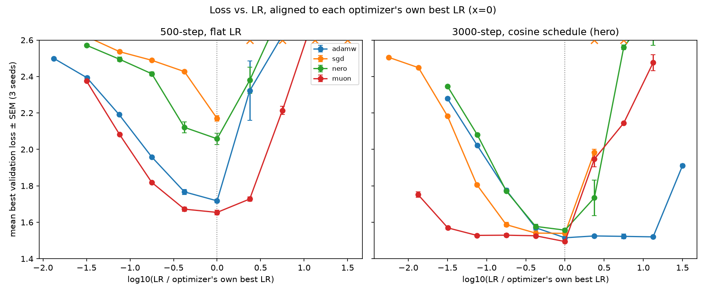
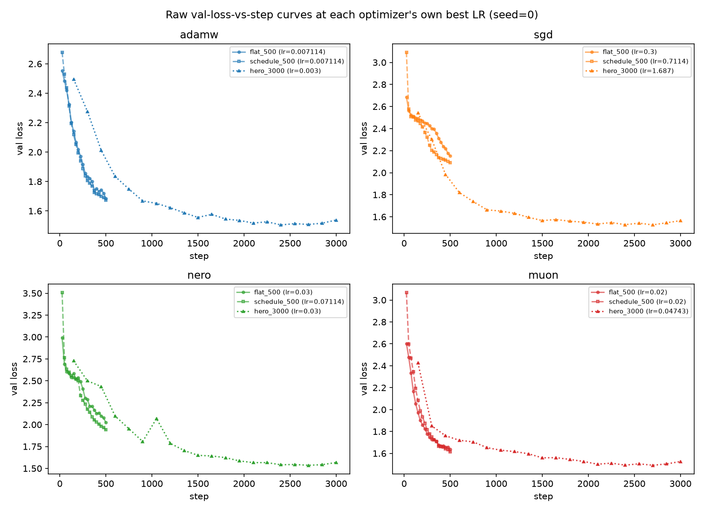

# Does architecture-aware optimization win a wider learning-rate basin?

## TL;DR

- **Question:** does an architecture-aware optimizer (Nero, Muon) trade
  best-case loss for a *wider* range of near-optimal learning rates than
  AdamW/SGD? Tested on a small decoder-only transformer on char-level text.
- **Core result:** at 500 steps flat LR, **Muon wins outright** (best loss,
  3x wider basin); SGD is the only one that diverges. Under longer
  training + a schedule (right panel below), most of that gap closes — all
  four land within 4.2% of each other and AdamW ties Muon's basin width at
  half the compute cost. Full story, including the one optimizer that
  *doesn't* catch up: [Results](#results).
- Full navigation: [Table of contents](#table-of-contents). (There's also
  an incomplete finance stretch — see [Branches](#branches).)



*Validation loss vs. learning rate, four optimizers (AdamW, SGD+momentum,
Nero, Muon) training a small decoder-only transformer (d_model=128, 4
layers, 4 heads, ~820K params) for next-character prediction on
char-level tiny-Shakespeare. Each optimizer's x-axis is normalized to
`log10(LR / that optimizer's own best LR)`, aligning all four at their own
optimum (x=0) regardless of absolute LR scale. **Left:** 500 training
steps, flat (unscheduled) LR — the project's original setup. **Right:**
3000 steps with a cosine-warmup LR schedule (the "hero" run below).
Points are mean best validation loss ± SEM across 3 seeds; "x" markers
denote LRs where at least one seed diverged.*

## Table of contents

- [Branches](#branches) *(folded)*
- [Versions](#versions) *(folded)*
- [Motivation](#motivation)
- [Hypothesis](#hypothesis)
- [Optimizer candidates](#optimizer-candidates)
- [Success criteria](#success-criteria-declared-before-running-any-experiment)
- [Data](#data)
- [Repo layout](#repo-layout)
- [How to run](#how-to-run)
- [Results](#results)
  - [Core experiment results](#core-experiment-results)
  - [Follow-up: schedule and longer training](#follow-up-cosine-warmup-schedule-and-longer-training)
  - [Compute and memory footprint](#compute-and-memory-footprint)
  - [Practical takeaways: choosing an optimizer](#practical-takeaways-choosing-an-optimizer-under-different-budgets)
  - [Ablation: LayerNorm affine params](#ablation-does-removing-layernorms-affine-params-help-nero)
  - [Finance stretch results](#finance-stretch-results)
- [Limitations](#limitations) *(folded)*
- [References](#references) *(folded)*

<details id="branches">
<summary><h2>Branches (click to expand)</h2></summary>

This repo uses three branches rather than one long-running one — each is a
self-contained unit of work with its own commits/results/writeup:

| Branch | Contents |
|---|---|
| [`master`](https://github.com/youngleox1/deeter-submission/tree/master) | Core text experiment (this README), the Nero rewrite, and the LayerNorm-affine ablation. |
| [`finance-stretch`](https://github.com/youngleox1/deeter-submission/tree/finance-stretch) | **Incomplete.** The finance stretch experiment: the neural pipeline finds ~no signal, but a simple 5-lag logistic regression on the same data does — a pipeline limitation, not market efficiency. Unlike the core experiment above, this was never rerun with the schedule/longer-training fix, even though that fix substantially changed the core conclusion — untested whether it would change this one too. |
| [`optimizer-extensions`](https://github.com/youngleox1/deeter-submission/tree/optimizer-extensions) | Exploring two more optimizer variants: LAMB, and a per-head Muon that orthogonalizes each attention head's weight sub-block independently. |

Git tags mark milestones across this repo's history — see [Versions](#versions)
below, `git tag -n99`, or the repo's Tags page.

</details>

<details id="versions">
<summary><h2>Versions (click to expand)</h2></summary>

| Tag | Milestone |
|---|---|
| [`v0.1.0-scaffold`](https://github.com/youngleox1/deeter-submission/releases/tag/v0.1.0-scaffold) | Initial scaffold — hypothesis, motivation, optimizer candidates, and success criteria declared in the README before any experiment code exists. |
| [`v0.2.0-core-pipeline`](https://github.com/youngleox1/deeter-submission/releases/tag/v0.2.0-core-pipeline) | Core experiment pipeline complete — model, optimizers (AdamW/SGD/Nero/Muon), text data loader, training loop, and sweep driver in place and tested. |
| [`v0.3.0-core-results`](https://github.com/youngleox1/deeter-submission/releases/tag/v0.3.0-core-results) | First-pass core experiment results (108-run sweep) — later found to use a buggy Nero implementation, see `v0.5.0-nero-fix`. |
| [`v0.4.0-finance-pipeline`](https://github.com/youngleox1/deeter-submission/releases/tag/v0.4.0-finance-pipeline) | Finance stretch pipeline complete — data loader with a leakage-regression test, shared core/finance training code, directional-accuracy/Brier-score eval. |
| [`v0.5.0-nero-fix`](https://github.com/youngleox1/deeter-submission/releases/tag/v0.5.0-nero-fix) | Nero corrected to match the reference implementation after a review catch (mean-centering, re-projection target, second-moment averaging, spurious 1D momentum) — core/finance/ablation sweeps rerun against the fix. |
| [`v0.6.0-finance-v2-binary-volscale`](https://github.com/youngleox1/deeter-submission/releases/tag/v0.6.0-finance-v2-binary-volscale) | Finance stretch v2 (`finance-stretch` branch) — binary direction + volatility scaling; mixed, honestly-reported result (a genuine directional-accuracy edge for the first time, but less loss structure than v1). |
| [`v0.7.0-schedule-and-longer-training`](https://github.com/youngleox1/deeter-submission/releases/tag/v0.7.0-schedule-and-longer-training) | Cosine-warmup schedule ablation + 3000-step longer-training check (top-3 LRs) — core ranking holds, but the schedule disproportionately helps Nero without closing its gap, and longer training flips Nero/SGD's relative order. |
| [`v0.8.0-hero-run`](https://github.com/youngleox1/deeter-submission/releases/tag/v0.8.0-hero-run) | **Hero run** — both v0.7.0 fixes combined on the full grid. Materially changes the headline: all four optimizers land within 4.2% of each other's best loss (vs. 31% at 500 steps flat), and AdamW's basin width ties Muon's. SEM and raw training curves added. |
| [`v0.9.0-optimizer-cost-and-takeaways`](https://github.com/youngleox1/deeter-submission/releases/tag/v0.9.0-optimizer-cost-and-takeaways) | Measured (not just asserted) compute/memory footprint per optimizer, a concrete NxN complexity breakdown, and a "Practical takeaways" section synthesizing everything into budget-based optimizer choice guidance. |

Not yet tagged: this Versions section itself, and the TL;DR/README
restructuring around it — still in progress as of this revision.

</details>

## Motivation

Optimal learning rate is known to shift with model size and architecture
rather than staying fixed (Kaplan et al., 2020, *"Scaling Laws for Neural
Language Models"*), which is precisely why LR search is a recurring cost
rather than a one-time one — each new scale or dataset can, in principle,
need its own sweep. A wider basin of near-optimal learning rates would help
in a few concrete, distinct ways:

- **Fewer sweep points needed, illustratively.**
- **LR transfer across scale.**
- **Avoiding catastrophic divergence, not just suboptimal loss.**
- **Lower operational risk under periodic retraining.**

<details>
<summary>Full motivation, with citations and caveats (click to expand)</summary>

- **Fewer sweep points needed, illustratively.** This is a hypothetical
  arithmetic example, not an established empirical result: *if* AdamW needs
  ~5-7 LR values on a log grid to find a near-optimal setting, and *if* an
  architecture-aware method has, say, a 3x wider basin at the same loss
  tolerance, that *could* translate into needing fewer grid points to reach
  similar confidence in the chosen LR. Whether that relationship actually
  holds, and by how much, is exactly what the core experiment below checks —
  it is a hypothesis to test, not a claimed result.
- **LR transfer across scale.** This is the practical motivation behind μP
  (Yang & Hu et al., 2021, *"Tensor Programs V: Tuning Large Neural Networks
  via Zero-Shot Hyperparameter Transfer"*) and modular-norm-style work
  (Large, Liu et al., NeurIPS 2024, *"Scalable Optimization in the Modular
  Norm"* — prior work of the author of this repo): tune once at small scale,
  reuse the same LR at larger scale instead of re-sweeping per size. A wider
  basin is what would make that transfer more forgiving of imperfect scaling
  rules.
- **Avoiding catastrophic divergence, not just suboptimal loss.** Wortsman et
  al. (2023, DeepMind, *"Small-Scale Proxies for Large-Scale Transformer
  Training Instabilities"*) show that small-scale LR sweeps can be used to
  anticipate and avoid training instabilities that would otherwise only
  appear at large scale. This is the concrete real-world case for the
  divergence-rate metric defined below: a wider *stable* region, not just a
  wider *near-optimal* region, is what actually de-risks a large training
  run in practice.
- **Lower operational risk under periodic retraining (own reasoning, not a
  literature claim).** If a model is refit on a regular cadence as the
  underlying data distribution drifts — the finance stretch experiment below
  is a concrete instance of this — a wide-basin optimizer plausibly needs
  less frequent LR re-sweeping. This is a speculative extension motivating
  the stretch experiment, not a result established elsewhere, and is treated
  as such.

</details>

## Hypothesis

An architecture-aware optimizer (update scaling based on layer shape/role, in the
style of modular-norm / architecture-aware LR scaling) does not just match a
well-tuned AdamW baseline at its best learning rate — it stays close to its best
loss across a *wider range* of learning rates. In other words: it trades a small
amount of best-case performance for robustness to LR misspecification.

This is tested twice, on two structurally different sequence domains:

1. **Core experiment**: small decoder-only transformer, language modeling on a
   small public text corpus.
2. **Stretch experiment**: the same model/optimizer code, applied to next-day
   return/direction forecasting on public daily equity data (via `yfinance`).

<details>
<summary><b>Why decoder-only transformer on text, not vision (tiny ViT on MNIST/CIFAR)?</b> (click to expand)</summary>

Both are legitimate choices, and both have precedent in prior architecture-aware
optimizer work (vision CNNs in the original Nero paper; GPT-style transformers
in modular-norm work). Vision would be the faster, more precedented choice if
this were a standalone core experiment. The reason for text+decoder here
specifically: the stretch experiment is also sequence forecasting, so keeping
the **model family fixed** (decoder-only sequence transformer) across core and
stretch means only the *data domain* changes between the two experiments, not
the domain and the architecture family at once. That keeps the transfer claim
("does the basin-width finding hold in a new domain") interpretable, rather
than conflated with "does it also hold for a different architecture class."

</details>

## Optimizer candidates

| Optimizer | Role | Architecture-aware? |
|---|---|---|
| AdamW | Standard baseline | No |
| SGD + momentum | Classic non-adaptive baseline | No |
| Nero | Own prior work (ICML'21, "Learning by Turning") | Yes — neuron-wise normalized updates |
| Muon | Current (2024-2025) architecture-aware method, orthogonalized momentum update, closely related in spirit to modular-norm | Yes — applied to 2D hidden-layer matrices |

Scoped to four on this branch — LAMB and a per-head Muon variant are explored
on [`optimizer-extensions`](https://github.com/youngleox1/deeter-submission/tree/optimizer-extensions)
instead of expanding this branch's grid; a full Modula/modular-norm
implementation was scoped out entirely for time-budget reasons.

**Fixed hyperparameters** (not swept — only LR varies in every sweep in this
project; see `src/optimizers.py` and `configs/core_sweep.yaml`, identical
across every core-experiment config used):

| Optimizer | Momentum / beta(s) | Weight decay |
|---|---|---|
| AdamW | betas=(0.9, 0.95) | 0.0 |
| SGD | momentum=0.9 | 0.0 (not configurable — see note) |
| Nero | beta=0.999 (2nd-moment EMA; momentum-free by design) | not supported at all (see note) |
| Muon | momentum=0.95 (orthogonalized branch); fallback branch betas=(0.9, 0.95) (hardcoded class default, not exposed via config) | 0.0 (see note) |

<details>
<summary>Notes on weight decay (click to expand)</summary>

Weight decay is 0 for all four optimizers, but not for the same reason in
each case — not previously spelled out in one place. For AdamW it's an
explicit config choice (`weight_decay: 0.0` in every config) — could be
swept, wasn't. For SGD and Nero, weight decay isn't a parameter this
codebase's `build_optimizer()` exposes at all (`torch.optim.SGD` is called
without a `weight_decay` kwarg, so it silently uses PyTorch's own default
of 0; `Nero.__init__` has no weight-decay parameter whatsoever). For Muon,
weight decay is genuinely absent from the from-scratch implementation on
both branches — already flagged in Limitations as a deviation from native
Muon's default of 0.1 (decoupled), but not previously connected to the
fact that *no* optimizer here uses any.

</details>

<details>
<summary>Notes on betas/momentum (click to expand)</summary>

This is a real limitation of the comparison, not just a disclosure:
AdamW's betas=(0.9, 0.95) is a deliberate but non-default choice (PyTorch's
own AdamW default is (0.9, 0.999)) chosen once and reused for Muon's
fallback branch too, for internal consistency — but neither AdamW's betas,
SGD's momentum, Nero's beta, nor Muon's momentum/fallback-betas were swept
or tuned per-optimizer. The whole basin-width/divergence comparison rests
on these secondary hyperparameters being "reasonable" defaults for each
method, not on them being independently optimized — so a genuinely fair
comparison would also sweep (or at least spot-check) these, not just LR.
Not attempted here due to time; a natural follow-up, same spirit as the
schedule/longer-training follow-ups above.

</details>

## Success criteria (declared before running any experiment)

Two complementary metrics are reported, not one — basin width alone hides the
more decision-relevant failure mode (divergence), and divergence alone doesn't
capture near-threshold sensitivity.

**Basin width.** For a given domain, an optimizer "wins" on this axis if,
across a fixed grid of learning rates:

- Its best achieved validation loss is within **X%** of AdamW's best validation
  loss (i.e. it is not simply *better* by finding a different optimum — parity
  at best-LR is the null-hypothesis-compatible outcome), **and**
- The range of learning rates for which it stays within that same X% band is
  **at least 2x wider** (in log-LR space) than AdamW's corresponding band.

<details id="basin-width-computation">
<summary><b>How basin width is actually computed</b> (click to expand — the exact formula and two caveats it implies)</summary>

(`analysis.ipynb`, not just described in prose): for a given optimizer, take
its own 9-point log-spaced LR grid, keep the subset of grid points whose
mean-across-seeds best validation loss is `<= threshold` (where
`threshold = AdamW's best loss x (1 + X)` — the same absolute threshold for
every optimizer, anchored to AdamW), and report

```
log10_basin_width = log10(max LR in that subset) - log10(min LR in that subset)
```

Two things worth being explicit about rather than leaving implicit:

- This is a **grid-resolution-limited estimate**, not the true continuous
  basin. The actual threshold-crossing point lies somewhere between two
  adjacent grid points; since the grid is evenly log-spaced at 0.375
  decades/step, the reported width is always a multiple of 0.375 and is a
  systematic *underestimate* of the true width (it can't resolve anything
  finer than one grid step).
- The code takes `max - min` of **all** qualifying grid points, without
  checking they're contiguous. If a non-qualifying point were sandwiched
  between two qualifying ones (a "hole" in the basin), this formula would
  silently report the full outer span rather than flagging the gap. In
  this project's actual data every qualifying set happens to be a
  contiguous run — checked with a programmatic assertion in
  `analysis.ipynb`, not just eyeballed — but that's a property of these
  particular loss curves being roughly unimodal in LR, not a guarantee the
  method provides.

</details>

**Divergence rate.** Fraction of (LR, seed) runs that diverge (NaN/Inf loss,
or loss exceeding a fixed blowup threshold) at each LR. This is reported
alongside basin width because it is binary and unambiguous, and arguably the
more practically important reason to want an architecture-aware optimizer —
avoiding catastrophic runs, not just staying within some tolerance band.

If either optimizer fails to win on either axis, that is reported as a
negative result, not re-framed after the fact. (Exact value of X% and the
blowup threshold are fixed in the core experiment config before the sweep is
run, and are not tuned post-hoc.)

**Secondary metrics** (diagnostic, not headline).

<details>
<summary>Full list, core + finance stretch (click to expand)</summary>

- Compute-to-target: steps needed to reach a fixed validation loss threshold,
  at each optimizer's own best LR (sample efficiency).
- Cross-seed variance at fixed LR (a distinct notion of robustness —
  run-to-run consistency rather than LR sensitivity).
- Update-norm trajectories over training, as a mechanistic diagnostic for
  *why* an optimizer is more or less robust (not a pass/fail criterion).

For the finance stretch, additionally reported:
- Directional accuracy vs. a naive baseline (predict-no-change /
  predict-previous-direction).
- A calibration metric (Brier score) rather than accuracy alone — a
  well-calibrated but modest model is a more honest result than a bare
  accuracy number, and calibration is the more quant-relevant property.

</details>

No claim of trading edge, Sharpe ratio, or backtest performance is made — the
model and task are deliberately simple, intended only to test whether the
basin-width/divergence-rate findings transfer out of domain.

## Data

- **Core:** char-level [tiny-Shakespeare](https://github.com/karpathy/char-rnn)
  corpus (public domain, ~1.1MB), vendored directly in this repo
  (`src/data/tinyshakespeare.txt`) rather than fetched at runtime, so the
  core experiment doesn't depend on network access to reproduce. See
  `src/data/text.py`.
- **Finance:** public daily OHLCV data pulled via the `yfinance` package for a
  small, fixed list of liquid US equity tickers, over a fixed historical
  window (not "most recent N days," so results don't shift if re-run
  later). This is external, freely available market data; no proprietary or
  non-public data is used. Cached CSVs are vendored in the repo for the same
  offline-reproducibility reason as the text corpus. See `src/data/finance.py`
  for the exact fetch logic and ticker list.

## Repo layout

```
src/
  model.py                    small decoder-only transformer
  optimizers.py               AdamW/SGD baselines + Nero + Muon (from-scratch, checked against references)
  lr_schedule.py              cosine-warmup LR schedule (opt-in, see Follow-up)
  train.py                    single training run
  sweep.py                    LR x optimizer x seed grid driver
  eval_finance.py             directional-accuracy / Brier-score eval (finance stretch)
  data/
    text.py                   core experiment data loader (vendored corpus)
    finance.py                finance stretch data loader (vendored cache + yfinance)
configs/
  core_sweep.yaml                          original core sweep (500 steps, flat LR)
  core_sweep_schedule_ablation.yaml        + cosine-warmup schedule, same grid/steps
  core_longer_training_check.yaml          top-3 LRs/optimizer, 3000 steps, flat LR
  core_sweep_hero.yaml                     both fixes combined, full grid, 3000 steps
  ablation_nero_no_ln_affine.yaml          LayerNorm-affine ablation
  finance_sweep.yaml                       finance stretch (lives on `finance-stretch`)
results/               sweep outputs (csv) and generated plots
tests/                 unit/smoke tests (see How to run)
analysis.ipynb         generates the original core-experiment plots/tables from results/*.csv
scripts/
  run_all.sh                                  reproduce the original core sweep + ablation
  run_followups.sh                            reproduce everything past that (schedule ablation,
                                               longer-training check, hero run, and analysis below) --
                                               substantially longer, see the script's own header
  analyze_schedule_and_longer_training.py     basin-width tables for the schedule/longer-training sweeps
  analyze_with_sem.py                         adds SEM to plots/tables; regenerates loss-vs-LR PNGs
  plot_summary_aligned_lr.py                  the headline own-optimum-aligned summary figure
  capture_raw_curves.py                       per-optimizer val-loss-vs-step curves (flat/schedule/hero)
  measure_optimizer_cost.py                   measures optimizer-state memory + per-step wall-clock cost
```

(Finance-specific files — `results/finance/`, `analysis_finance.ipynb`,
`scripts/investigate_finance_signal.py` — live on the `finance-stretch`
branch; `Lamb`/per-head `Muon` and their sweep config live on
`optimizer-extensions`. See [Branches](#branches).)

## How to run

```bash
pip install -r requirements.txt
pytest                          # run test suite
python -m src.sweep --config configs/core_sweep.yaml
python -m src.sweep --config configs/ablation_nero_no_ln_affine.yaml
# or, to do all of the above in one go (~20 min on a single GPU):
bash scripts/run_all.sh
```

That reproduces the original 500-step core sweep + LayerNorm-affine
ablation only. Everything past that — the schedule ablation, the
longer-training check, and the hero run the headline figure and TL;DR are
built on — is reproduced by a separate, substantially longer script
(~3 hours on a single GPU, dominated by the hero run's 108 runs x 3000
steps):

```bash
bash scripts/run_followups.sh
```

## Results

**Summary figure, before the full walkthrough below:** loss vs. LR for each
optimizer, with the x-axis normalized to `log10(LR / that optimizer's own
best LR)` so all four curves are aligned at their own optimum (x=0) instead
of compared at shared absolute LR values. Left panel is the original
500-step flat-LR sweep; right panel is the 3000-step cosine-schedule hero
run (same full grid, both fixes from Follow-up combined).


**How longer training + schedule changes best loss and basin size, in one
place:**

| Optimizer | Best loss, flat → hero | Basin width @ X=10% around **own** best, flat → hero |
|---|---|---|
| AdamW | 1.718 → 1.515 (-12%) | 0.375 → **1.500** (4x wider) |
| Muon | 1.654 → 1.494 (-10%) | 1.125 → 1.495 (+33%) |
| SGD | 2.170 → 1.539 (-29%) | 0.000 (single-point optimum) → 0.750 |
| Nero | 2.058 → 1.557 (-24%) | 0.375 → **0.375 (unchanged)** |

Two things worth pulling out that aren't obvious from the AdamW-anchored
tables in Follow-up below:

- **Basin width measured around each optimizer's *own* best (not AdamW's)
  tells a cleaner story than the AdamW-anchored version.** Under flat LR,
  SGD and Nero weren't "basin-less" in an absolute sense — SGD has a sharp
  single-point optimum (width exactly 0) and Nero has a real if narrow
  0.375-decade basin around its own best; they just never got close enough
  to *AdamW's* best for the AdamW-anchored metric to register anything.
  That distinction matters because the paper's actual hypothesis is about
  each optimizer's own LR-sensitivity, not proximity to AdamW specifically.
- **Nero is the one optimizer whose own-basin width is completely
  unchanged by longer training + schedule (0.375 → 0.375), despite its
  best loss improving 24%.** AdamW's own-basin more than quadruples and
  Muon's and SGD's widen substantially, but Nero's loss curve around its
  own optimum is exactly as sharply peaked after the fix as before — the
  hero run's earlier-reported improvement in Nero's *AdamW-relative*
  standing comes entirely from AdamW's threshold loosening enough to reach
  Nero's already-existing points, not from Nero itself becoming more
  LR-tolerant. Not explained here; flagged as a genuine, unexplained
  asymmetry rather than glossed over.

See `scripts/plot_summary_aligned_lr.py` for how both panels and the
own-optimum basin widths above are computed.

### Core experiment results

Full sweep: 4 optimizers x 9 LRs x 3 seeds = 108 runs, 500 steps each. Raw
results: `results/core/sweep_results.csv`. Analysis and plots:
`analysis.ipynb` (see `results/core/*.png` for the rendered figures).

**Process note, disclosed rather than fixed quietly:** the loss-tolerance
threshold X% (used to define "within X% of AdamW's best") was never actually
committed to a config file before this sweep ran, despite the intent stated
above. All three plausible values (5%, 10%, 20%) are reported below rather
than picking one after seeing the results. The qualitative conclusion is
identical across all three, so the finding is not an artifact of this gap —
but the gap itself is real and is reported as such, not glossed over.

| Optimizer | Own best val loss (mean ± SEM, 3 seeds) | Beats AdamW's best (1.718)? | log10 basin width @ X=10% |
|---|---|---|---|
| AdamW | 1.718 ± 0.010 | (reference) | 0.375 |
| **Muon** | **1.654 ± 0.013** | **Yes** | **1.125 (3x wider)** |
| SGD | 2.170 ± 0.015 | No — never within 20% at any LR tested | diverges above lr≈0.71 (all seeds) |
| Nero | 2.058 ± 0.031 | No — within 20% at exactly one LR (0.03), zero-width basin | n/a |

*(SEM = std/sqrt(3) across seeds at each optimizer's own best LR; with only
3 seeds this is itself a noisy estimate, not a tight confidence interval —
see `results/core/loss_vs_lr.png` for the full per-LR error bars.)*

**Revision note:** an earlier version of this table used a meaningfully
buggy Nero implementation (see `v0.5.0-nero-fix` tag / git history for the
full diagnosis — no mean-centering, wrong re-projection target, sum-vs-mean
second moment, spurious momentum on 1D params). Nero's numbers above are
from the corrected implementation, matching the reference
(github.com/jxbz/nero) closely. AdamW/SGD/Muon are unchanged (confirmed
identical to prior digits — they weren't touched by the fix, and results
are seeded/deterministic).

Two separate findings, not one clean story:

1. **Muon wins on both pre-declared axes, and robustly** — holds at X=5%,
   10%, and 20% alike. It also beats AdamW's best loss outright, which is
   actually outside what the pre-declared criteria anticipated (the design
   assumed an architecture-aware method would trade a bit of best-case
   performance for a wider basin; Muon didn't have to make that trade here).
2. **The corrected Nero still underperforms AdamW substantially**, though
   less than the buggy version did (best loss 2.058 vs the old 2.091; best
   LR shifted a full decade, from 0.0023 to 0.03). At the loosest tested
   threshold (X=20%) it now barely qualifies as "within range" — but at a
   single LR point, not a range, so it has effectively zero basin width by
   this metric regardless of implementation correctness. This is a genuine
   negative result, not a bug (Nero's tests now check the correct
   invariants — unit-norm + mean-zero per neuron after construction and
   after every step — and all pass). Two plausible explanations were raised
   for the remaining gap — no LR warmup/schedule, and the 500-step horizon
   being too short — and both are tested directly in
   [Follow-up](#follow-up-cosine-warmup-schedule-and-longer-training) below:
   a schedule helps Nero more than the other three but doesn't close the
   gap, and longer training compresses the overall spread but doesn't
   rescue Nero's relative standing either (SGD overtakes it at 3000 steps).
   The gap remains a genuine, still-open question after both explanations
   were checked, not explained away.

**Divergence rate:** SGD is the only optimizer that diverges anywhere in its
sampled grid (all 3 seeds, for every LR ≥ 0.71 — see
`results/core/divergence_rate.png`). AdamW, Nero, and Muon never diverge
anywhere in their sampled ranges. This partially, not fully, supports the
architecture-aware motivation: it cleanly separates SGD from the other
three, but AdamW (not architecture-aware, by this project's definition)
also never diverges — so divergence avoidance alone doesn't cleanly
distinguish "architecture-aware" from "not" in this experiment.

### Follow-up: cosine-warmup schedule and longer training

Two limitations flagged in the original writeup (see Limitations) — no LR
schedule anywhere, and 500 steps being short — were each named as a
candidate explanation for Nero's underperformance above. Both are tested
directly here, one variable at a time, per the exact follow-ups already
proposed in Limitations: a same-grid schedule ablation, and a longer-training
check on each optimizer's own top-3 short-horizon LRs.

**Setup A — schedule ablation** (`configs/core_sweep_schedule_ablation.yaml`,
`results/core/schedule_ablation_results.csv`): identical to the core sweep
(same model, same 9-LR x4-optimizer x3-seed grid, still 500 steps) with
`use_cosine_schedule=True, warmup_steps=50` (10% linear warmup, cosine decay
to 10% of peak LR) — the one variable changed, so any difference is
attributable to the schedule and not a confound with more training.

| Optimizer | Own best (flat, ±SEM) | Own best (schedule, ±SEM) | Best LR (flat → schedule) | Diverged (flat → schedule) |
|---|---|---|---|---|
| AdamW | 1.718 ± 0.010 | 1.695 ± 0.014 | 0.0071 → 0.0071 (unchanged) | 0/27 → 0/27 |
| **Nero** | 2.058 ± 0.031 | **1.939 ± 0.015** | 0.03 → 0.071 (+1 grid step) | 0/27 → 0/27 |
| Muon | 1.654 ± 0.013 | 1.634 ± 0.008 | 0.02 → 0.02 (unchanged) | 0/27 → 0/27 |
| SGD | 2.170 ± 0.015 | 2.105 ± 0.006 | 0.3 → 0.71 (+1 grid step) | 12/27 → 9/27 |

**The qualitative conclusion from the flat-LR core result is unchanged under
the schedule** — recomputing the same basin-width table
(`scripts/analyze_schedule_and_longer_training.py`) shows Muon still wins on
both best loss and basin width at every tested X (5/10/20%), and SGD/Nero
still never land within even the loosest (X=20%) tolerance of AdamW's best
as anything more than a single, zero-width LR point. So the original
finding was not an artifact of the missing schedule.

**But there is a real secondary finding: the schedule helps Nero
disproportionately.** Nero's best loss improves 5.8% (more than double
AdamW's or Muon's ~1-1.5% improvement), and its optimal LR shifts a full
grid step higher — consistent with the earlier LayerNorm-affine ablation's
finding that Nero specifically struggles at high LR (warmup delays exposure
to that regime; decay retreats from it before it destabilizes things). The
same mechanism rescues one previously-diverging SGD grid point
(lr≈0.71 no longer diverges, and becomes SGD's new best-LR). **Despite this,
Nero's gap to AdamW and Muon does not close** — 1.939 is still meaningfully
worse than AdamW's 1.695 — so the schedule explains part of, but not all of,
Nero's underperformance. See `results/core/schedule_ablation_loss_vs_lr.png`
for the flat-vs-schedule overlay.

**Setup B — longer training** (`configs/core_longer_training_check.yaml`,
`results/core/longer_training_results.csv`): each optimizer's own top-3 LRs
from the 500-step sweep, rerun for 3000 steps (6x) at a flat LR (no
schedule, to isolate step count from Setup A's variable) — the exact
"longer-training check on the top 2-3 LRs per optimizer" Limitations
proposed.

| Rank @ 3000 steps | Optimizer | Best loss (3000 steps, ±SEM) | Best loss (500 steps, ±SEM) |
|---|---|---|---|
| 1 | Muon | 1.533 ± 0.004 | 1.654 ± 0.013 |
| 2 | AdamW | 1.545 ± 0.007 | 1.718 ± 0.010 |
| 3 | SGD | 1.577 ± 0.016 | 2.170 ± 0.015 |
| 4 | Nero | 1.587 ± 0.012 | 2.058 ± 0.031 |

**The overall spread compresses sharply with more training** (1.53-1.59 at
3000 steps vs. 1.65-2.17 at 500 steps) — direct confirmation of the
Limitations bullet's own prediction that the 500-step ranking reflects
early-training behavior, not asymptotic quality. **But within that
compression, SGD overtakes Nero** — reversing their relative order from the
500-step result (Nero < SGD there; SGD < Nero here) — so longer training
does not rescue Nero's relative standing, and by this narrow test actually
worsens it (last place, not third). Muon and AdamW's 1st/2nd ranking is
stable across both step counts.

**Caveat, stated plainly rather than glossed over:** this only reruns each
optimizer's own *500-step-optimal* top-3 LRs, not a fresh grid at 3000
steps — it is not a full re-sweep. It's notable that at 3000 steps, Nero's
second-best tested LR (0.01265) already clearly beats its 500-step-optimal
LR (0.03) — 1.587 vs. 1.663 — which is a hint, not proof, that Nero's true
long-horizon optimum may sit even lower than the narrow window tested here.
A full re-sweep at 3000 steps is the natural next step to confirm or rule
that out, not attempted here due to time.

**Setup C — hero run** (`configs/core_sweep_hero.yaml`,
`results/core/hero_sweep_results.csv`): combines both fixes at once, on the
**full** 9-LR x4-optimizer x3-seed grid rather than a narrow LR subset —
`max_steps=3000, use_cosine_schedule=True, warmup_steps=500` (same 500-step
warmup as Setup A, just measured against the 6x longer horizon: 16.7% of
the run instead of 10%). This is the run Setups A and B were each isolating
one variable of.

| Optimizer | Own best, 500-step flat (±SEM) | Own best, hero (±SEM) | Best LR (flat → hero) | Diverged (flat → hero) |
|---|---|---|---|---|
| **Muon** | 1.654 ± 0.013 | **1.494 ± 0.007** | 0.02 → 0.047 | 0/27 → 0/27 |
| AdamW | 1.718 ± 0.010 | 1.515 ± 0.007 | 0.0071 → 0.003 | 0/27 → 0/27 |
| SGD | 2.170 ± 0.015 | 1.539 ± 0.007 | 0.3 → **1.687** | 12/27 → **6/27** |
| Nero | 2.058 ± 0.031 | 1.557 ± 0.009 | 0.03 → 0.03 (unchanged) | 0/27 → 0/27 |

| log10 basin width @ X | AdamW (flat → hero) | Muon (flat → hero) | SGD (flat → hero) | Nero (flat → hero) |
|---|---|---|---|---|
| 5% | 0.375 → 1.500 | 0.750 → 1.495 | n/a (0 qualifying LRs) → 0.750 | n/a (0 qualifying LRs) → 0.375 |
| 10% | 0.375 → 1.500 | 1.125 → 1.495 | n/a → 0.750 | n/a → 0.375 |
| 20% | 0.750 → 1.875 | 1.125 → 1.875 | n/a → 1.125 | 0.000 → 1.125 |

**This materially changes the headline picture, and is reported plainly
rather than downplayed.** Under the flat 500-step condition, Muon's basin
was 3x wider than AdamW's at X=10% (1.125 vs. 0.375) and SGD/Nero never
qualified as "near AdamW's best" at any tested tolerance. Under the hero
condition:

- **All four optimizers land within 4.2% of each other's best loss**
  (1.494-1.557), vs. a 31% spread (1.654-2.170) at 500 steps flat. Muon is
  still nominally best, but its margin over AdamW shrinks from 3.9% to 1.4%.
- **AdamW's basin width now matches or very slightly exceeds Muon's**
  (1.500 vs. 1.495 at X=5-10%; tied at 1.875 at X=20%) — the "3x wider"
  finding does not hold once schedule and longer training are combined.
  The 0.005 log10 difference at X=5-10% is within one grid step's worth of
  noise and should not be read as AdamW actually winning; the honest
  reading is a **tie**, not a reversal.
- **SGD's divergence problem is substantially, not fully, resolved**: it
  now trains stably up to lr=1.687 (5.6x higher than where it used to
  diverge under flat LR) and that becomes its new best LR — but it still
  diverges at lr≥4. SGD also now has a real, non-trivial basin (0.75-1.125
  log10) instead of none.
- **Nero's best LR is unchanged (0.03, same as the original flat run)**,
  unlike Setup A where schedule alone shifted it to 0.071 — an interesting
  wrinkle suggesting the two fixes don't simply compound in the same
  direction for every optimizer. Nero still has the narrowest hero-run
  basin of the four, but it is no longer zero.

**What this means for the original claim:** the flat-LR, 500-step
comparison was not "wrong," but it substantially overstated Muon's
advantage — most of the gap it measured was closed by two standard training
hygiene fixes (schedule, adequate training length) that have nothing to do
with architecture-awareness per se. The narrower, more defensible claim
supported by the hero run is that Muon is a **slightly better, never worse**
default with **modestly better tolerance to LR misspecification at short,
unscheduled horizons specifically** — not the strong "3x wider basin, other
optimizers never come close" result the original setup suggested. See
`results/core/hero_loss_vs_lr.png` for the flat-vs-hero overlay and
`results/core/hero_basin_width.csv` for the full table.

**Caveat:** this is one specific combination of schedule length, warmup
fraction, and step count, not a sweep over those hyperparameters — it
doesn't rule out that a differently-tuned schedule or step count could
reopen a wider gap in either direction. Only 3 seeds per point, same as
every other sweep in this project; SEM values above should be read as
approximate, not tight confidence intervals.

**Raw training curves**, not just the summary best/final scalars, for each
optimizer's own best LR (seed=0 only — for qualitative shape inspection,
not a seed-averaged claim).

<details>
<summary>Val-loss-vs-step curves, flat / schedule / hero (click to expand)</summary>



Data: `results/core/raw_curves.csv` (columns: `optimizer, condition, lr,
step, val_loss`), generated by `scripts/capture_raw_curves.py`.

</details>

### Compute and memory footprint

**Measured rather than just asserted** (`scripts/measure_optimizer_cost.py`,
on this project's actual model — 821,760 params;
`results/core/optimizer_cost.csv`). Two separate things, since they don't
move together: optimizer *state* memory (exact, analytic — element count in
`optimizer.state`) and *per-step wall-clock time* (empirical — mean over the
full 500-step sweep's own recorded `wall_clock_seconds`,
`results/core/sweep_results.csv`, n=27 runs/optimizer, the more trustworthy
number vs. a short standalone microbenchmark).

| Optimizer | State memory (extra, vs. param count) | State memory (fp32) | ms/step (sweep-measured) | Peak CUDA memory (measured) |
|---|---|---|---|---|
| SGD | 1.00x (momentum only) | 3.29 MB | 22.4 ms | 316.7 MB |
| AdamW | 2.00x (m + v) | 6.57 MB | 22.8 ms | 320.0 MB |
| **Nero** | **0.01x** (per-neuron stats only, not per-parameter) | **0.03 MB** | 42.0 ms (1.8x AdamW) | 313.5 MB |
| Muon | 1.04x (mostly momentum-only; small AdamW-fallback branch) | 3.43 MB | 45.9 ms (2.0x AdamW) | 316.8 MB |

**Concretely, for a single N x N weight matrix** (this project's attention
and MLP hidden matrices are this shape, or close — `proj` is exactly 128x128;
`fc1`/`fc2` are 128x512, i.e. N x cN, see the general note below), to explain
*why* the measured numbers come out this way, not just that they do:

| Optimizer | Extra memory for this matrix | Compute for this matrix, per step |
|---|---|---|
| AdamW | `2N²` (m, v — full matrix each) | `O(N²)` — elementwise (mul/add/sqrt/div per entry) |
| SGD | `N²` (momentum — full matrix) | `O(N²)` — elementwise |
| **Nero** | **`O(N)`** — one norm scalar *per row*, not per entry | `O(N²)` — same order as AdamW/SGD (every entry still gets read to compute the row norms/means), just 2-3x the constant from doing that twice per step |
| Muon | `N²` (momentum — full matrix, same as SGD) | **`O(N³)`** — 5 Newton-Schulz iterations, each an N x N matrix multiply (`X @ X.T`, `A @ A`, `B @ X`), dominating the `O(N²)` momentum update |

So per weight matrix: **Nero's memory drops from `O(N²)` to `O(N)`** — a
real asymptotic win, not just a smaller constant — while **Muon's compute
grows from `O(N²)` to `O(N³)`** — a real asymptotic penalty, from the only
matrix-multiply (as opposed to elementwise/row-reduction) operation any of
the four optimizers performs. Both effects are driven by the same variable,
matrix width `N`, so both should become *more* pronounced at larger `N`
(bigger models), not less — an asymptotic argument, not an empirically
verified trend, since this project only tested one fixed width
(`d_model=128`; no scaling sweep was run). For a rectangular `out x in`
matrix, read `N` above as `min(out, in)` for the Newton-Schulz term and as
`out` (the number of rows/neurons) for Nero's memory term — the two aren't
the same axis in general, though they coincide for the square case above.

**Memory and compute don't rank the same way, and that's the interesting
part:**

- **Nero has by far the smallest optimizer-state footprint** — its second
  moment is tracked per-*neuron* (one scalar per output row,
  `_neuron_norm(p)`), not per-parameter, so state size scales with neuron
  *count*, not weight *count*. For this model that's a 200x smaller state
  than AdamW's, not just a constant-factor win. But it is **not** the
  fastest — at 1.8x AdamW's per-step time, it's the second-slowest of the
  four, because the per-neuron mean/norm reprojection (`_neuron_mean`,
  `_neuron_norm`) runs twice per step (once for the gradient-normalization
  statistics, once for the post-step re-centering/re-projection
  constraint) — extra reduction passes over the full parameter tensor that
  AdamW/SGD never do.
- **Muon's state memory is close to SGD's** (1.04x — most parameters are
  transformer hidden matrices that only get a momentum buffer, not a full
  AdamW-style state), but it is the **slowest** optimizer measured, at 2.0x
  AdamW's per-step time — the `O(N³)` Newton-Schulz term above
  (`zeropower_via_newtonschulz`, 5 matrix-matrix-multiply iterations per
  hidden weight matrix per step), the only super-linear, non-elementwise
  cost of the four. At this model's width (d_model=128, mlp hidden=512)
  that overhead is still small in absolute wall-clock terms, but per the
  asymptotic argument above it should grow, not shrink, at larger widths.
- **Peak CUDA memory is ~identical across all four (313-320 MB) at this
  model's scale** — the state-memory differences above (kilobytes to a few
  MB) are completely swamped by CUDA context and activation memory for a
  toy model this small. The 200x state-memory advantage Nero shows
  analytically would only become practically visible at a model scale
  where optimizer state is a meaningful fraction of total memory —
  untested here, since that's well outside this project's compute budget.

### Practical takeaways: choosing an optimizer under different budgets

Synthesizing the flat/schedule/hero comparisons above with the compute and
memory numbers from Optimizer candidates — scenario-based guidance, not a
universal ranking, since "best" depends on what's actually being optimized
for (loss, robustness, wall-clock, or memory).

1. **Short, unscheduled training (this project's original 500-step flat-LR
   setup): Muon is the clear choice.** Best loss *and* ~3x wider basin than
   AdamW — worth its ~2x per-step compute cost specifically because the
   advantage is large here. Avoid SGD in this regime: it diverges over half
   its sampled LR range and never gets close to AdamW's best either.
2. **Schedule affordable, training still short (Setup A): the ranking
   doesn't change, so the choice doesn't either.** The schedule narrows
   things somewhat (Nero improves 5.8%, SGD's divergence range shrinks by
   1/3) but Muon still wins outright — still worth the extra compute here.
3. **Adequate training length + schedule (the hero run): this is where the
   calculus flips.** AdamW ties Muon on both loss (within 1.4%) and basin
   width, at roughly half Muon's per-step cost. If a normal training length
   and schedule are affordable — which is standard practice regardless of
   this project — **AdamW is the pragmatic default**; Muon's
   architecture-awareness stops clearly paying for itself once these two
   "free" fixes are in place.
4. **Memory-constrained regimes: Nero's footprint is a real, distinct
   reason to consider it, independent of the loss comparison.** Nero never
   wins on loss in any tested condition, but its ~200x smaller optimizer
   state (per-neuron stats, not per-parameter) is an axis of value the
   loss/basin numbers don't capture at all. Not validated at a scale where
   it would matter (this model's optimizer state is a few MB either way —
   see Compute and memory footprint above) — but the mechanism (state size
   scales with neuron count, not parameter count) is real and would matter
   more, not less, at larger model scale.
5. **Unattended / can't-babysit-the-run training: avoid SGD.** It's the
   only optimizer that diverged anywhere in this project — in every sweep,
   flat or scheduled, short or long (12/27 → 9/27 → 6/27 runs diverged
   across the flat/schedule/hero conditions respectively). AdamW, Nero, and
   Muon never diverged once, across all ~360 runs in this project's four
   core-experiment sweeps combined. For a pipeline that can't tune LR
   per-run, that zero-divergence property may matter more than small loss
   differences.
6. **Raw compute-constrained regimes (many small experiments, cheapest
   possible per-step cost): SGD or AdamW**, both ~2x cheaper per step than
   Nero/Muon (see Compute and memory footprint above) — if a schedule can
   be afforded to tame SGD's instability, its simplicity may be worth the
   small remaining loss gap, especially at longer horizons where that gap
   is smallest anyway.

**The meta-lesson, stated plainly:** most of this project's flashy
500-step "Muon wins outright" headline turned out to be a training-hygiene
artifact, not a fundamental algorithmic result — always rule out a missing
schedule or inadequate training length before concluding one optimizer is
intrinsically better than another. That said, two properties survived
every condition tested and aren't hygiene-dependent: **architecture-aware
optimizers (Nero, Muon) never diverged**, in any of ~360 runs, and
**Nero's per-neuron memory footprint is structurally, not incidentally,
smaller** — both are real reasons to reach for them regardless of whether
the loss gap has been closed by other means.

### Ablation: does removing LayerNorm's affine params help Nero?

**Result: mixed, not a clean confirmation or rejection.** LayerNorm's affine
params don't appear to be the main driver of Nero's overall underperformance
— but they do provide some stabilizing effect specifically at high LR, the
opposite direction from the original hypothesis.

<details>
<summary>Setup and full result (click to expand)</summary>

Raised during review: Nero's projection assumes a neuron's weight scale
(and, per the corrected implementation, its mean) is irrelevant because
downstream normalization absorbs it — an assumption that weakens if the
normalization layer itself has a learnable affine scale/shift (handled by
a separate, uncoordinated update rule for 1D params). Tested directly:
same LR grid/seeds/steps as the core sweep, `model.layernorm_affine=False`
(`configs/ablation_nero_no_ln_affine.yaml`,
`results/ablations/nero_no_ln_affine/sweep_results.csv`), rerun against the
corrected Nero.

At most LRs (0.0009 through 0.03, and again at 0.07), keeping the affine
params does slightly better than removing them — the hypothesis is not
supported there. But at lr=0.4, removing them is clearly better (2.85 vs
3.08), and at the highest LR (0.95), keeping them is much better (3.28 vs
5.71 — removing affine makes the high-LR degradation much worse, not
better). So the honest read is: LayerNorm's affine params don't appear to
be the main driver of Nero's overall underperformance (removing them
doesn't fix it, and mostly makes things slightly worse) — but they do
appear to provide some stabilizing effect specifically at high LR, which is
the opposite direction from the original hypothesis. Reported as a
tested-and-not-confirmed hypothesis with a genuine, unanticipated
secondary finding, not retro-fitted into either story after the fact.

</details>

### Finance stretch results

Lives on the [`finance-stretch`](https://github.com/youngleox1/deeter-submission/tree/finance-stretch)
branch, not this one — see its README for the full writeup. Headline
(also in the [TL;DR](#tldr) above): the neural pipeline finds ~no
directional signal, but a simple 5-lag logistic regression on the same
data does — so the honest conclusion is a pipeline limitation
(8-bin discretization + cross-entropy objective likely swamps a weak
linear effect), not evidence of market efficiency.

<details id="limitations">
<summary><h2>Limitations (click to expand)</h2></summary>

- **X% was not pre-registered in a config file before the core sweep ran**
  (see Core experiment results above for how this is handled: all three
  candidate values are reported, and the conclusion is stable across them).
- **Only LR was swept — momentum/beta values and weight decay were fixed by
  a priori choice per optimizer, not tuned or swept** (see the "Fixed
  hyperparameters" note under Optimizer candidates above for the exact
  values and why weight decay ends up at 0 for all four, for different
  reasons in each case). The comparison's validity rests on these being
  reasonable, not optimized, defaults. Not addressed here due to time.
- **No LR schedule of any kind is used in the core sweep** — flat, constant
  LR for its full duration, no warmup, no decay. **Addressed**: a same-grid
  cosine-warmup ablation (see
  [Follow-up](#follow-up-cosine-warmup-schedule-and-longer-training) above)
  confirms the core ranking is not an artifact of this — Muon still wins on
  both loss and basin width — but finds a real secondary effect: the
  schedule disproportionately helps Nero (best loss improves 5.8%, vs.
  ~1-1.5% for AdamW/Muon) and rescues one SGD divergence point, without
  closing Nero's gap to AdamW or Muon. **Combined with longer training**
  (the hero run, full grid), the schedule's effect is much larger: all four
  optimizers land within 4.2% of each other and AdamW's basin width ties
  Muon's — see Setup C in Follow-up above.
- **500 training steps is short** relative to typical conventions for this
  exact toy setup (e.g. nanoGPT's own char-level tiny-Shakespeare example
  commonly trains several thousand steps), meaning the core ranking risked
  reflecting early-training behavior rather than asymptotic quality.
  **Partially addressed**: a 3000-step (6x) rerun of each optimizer's own
  top-3 500-step-optimal LRs (see
  [Follow-up](#follow-up-cosine-warmup-schedule-and-longer-training) above)
  confirms the spread compresses sharply with more training, as predicted —
  but also finds SGD overtakes Nero at 3000 steps, reversing their 500-step
  order, so longer training does not rescue Nero's relative standing. Only
  a narrow, short-horizon-selected set of LRs was retested, not a fresh
  grid, so this remains partial: Nero's true long-horizon-optimal LR may
  lie outside the window tested (see the caveat in Follow-up above).
  **Fully addressed via the hero run** (full grid, both fixes combined,
  Setup C in Follow-up above): confirms the compression effect on the full
  grid, not just the narrow top-3-LR window, and additionally shows SGD's
  divergence range roughly halves (12/27 → 6/27) once trained longer with
  a schedule.
- **Muon is a simplified, from-scratch reproduction**, not a verbatim port
  of a reference implementation. (Muon wasn't in any version of PyTorch
  when this was written — it was added as `torch.optim.Muon` in PyTorch
  2.9; this project's installed torch is 2.7.1, which doesn't have it.)
  Checked against the now-official implementation
  (github.com/pytorch/pytorch/blob/main/torch/optim/_muon.py) while
  investigating a per-head variant on a separate branch: our Newton-Schulz
  coefficients and LR-adjustment formula match exactly, but our momentum
  is **plain (heavy-ball)**, not the native implementation's **default
  Nesterov** momentum (orthogonalization input is `g_t + momentum * B_t`,
  not just the momentum buffer `B_t`) — matches native Muon's
  `nesterov=False` option, just not its default. We also apply no weight
  decay (native defaults to 0.1, decoupled). Neither difference has been
  tested for impact on the results above; noted here rather than silently
  left as an unexamined assumption. **Nero was initially a much more
  meaningfully different reimplementation** (missing mean-centering,
  wrong projection target, sum-vs-mean second moment, spurious momentum
  on 1D params) until corrected against the actual reference code
  (github.com/jxbz/nero) — see `v0.5.0-nero-fix` tag. The corrected
  version's remaining underperformance vs. AdamW is treated as a genuine
  finding, not attributed to further unverified implementation
  differences.
- **LAMB and full Modula/modular-norm were scoped out** of this branch's
  optimizer comparison — LAMB and a per-head Muon variant are explored on
  `optimizer-extensions` instead (see [Branches](#branches)); Modula was
  scoped out entirely for time-budget reasons.
- Muon's per-parameter-group hybrid design (orthogonalized update for 2D
  hidden matrices, AdamW-style fallback for the rest) means its "LR" in the
  sweep only varies the Muon branch; the fallback-branch LR is held fixed
  (see `configs/core_sweep.yaml`). A full 2D sweep over both would be more
  thorough but was out of scope here.
- **The finance stretch's neural pipeline fails to extract signal that
  demonstrably exists** in this exact data (see Finance stretch results
  above, and the `finance-stretch` branch for the full writeup) — likely
  because discretizing returns into 8 bins and optimizing full next-bin
  cross-entropy is a much noisier objective than directly predicting
  binary direction. Swapping in a direct binary classification head is the
  natural fix; not attempted there due to time.

</details>

<details id="references">
<summary><h2>References (click to expand)</h2></summary>

- Kaplan, J. et al. "Scaling Laws for Neural Language Models." 2020.
- Yang, G. & Hu, E. et al. "Tensor Programs V: Tuning Large Neural Networks
  via Zero-Shot Hyperparameter Transfer." 2021.
- Liu, Y., Bernstein, J., Meister, M., Yue, Y. "Learning by Turning: Neural
  Architecture-Aware Optimisation." ICML 2021.
- Large, T., Liu, Y. et al. "Scalable Optimization in the Modular Norm."
  NeurIPS 2024.
- Wortsman, M. et al. "Small-Scale Proxies for Large-Scale Transformer
  Training Instabilities." 2023.
- Jordan, K. et al. "Muon: An optimizer for hidden layers in neural
  networks." 2024. (Technical report / blog, not peer-reviewed — noted as
  such since it's a newer, less formally vetted method than the others
  above; since incorporated into PyTorch core as `torch.optim.Muon` in
  2.9, see Limitations.)
- You, Y. et al. "Large Batch Optimization for Deep Learning: Training BERT
  in 76 Minutes." ICLR 2020. (LAMB — implemented on `optimizer-extensions`,
  see Branches above.)

</details>

---

*Footnote: most of the code, experiments, and this writeup were generated
by Claude. The commit history is also noisier than a single author would
produce by hand — more, smaller commit-and-push cycles than strictly
necessary — because reviewing changes on GitHub's mobile site was the most
convenient way to check work in progress from a phone.*
